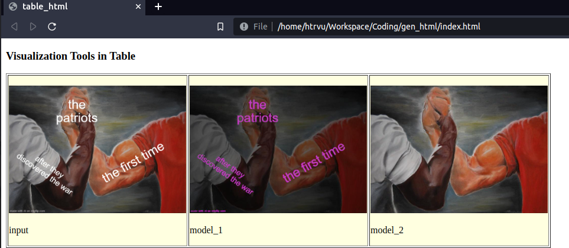
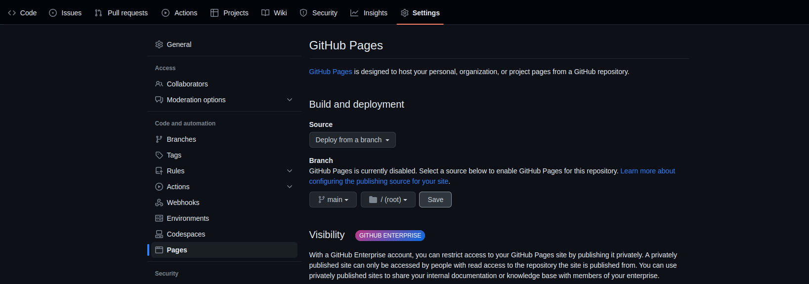
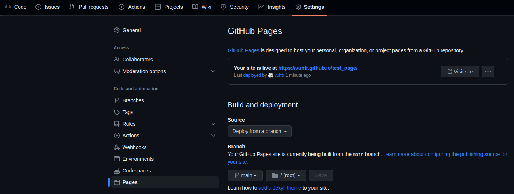

# Image Pairwise Visualization Tool

## Generate HTML files

Installation:

```bash
pip install dominate
```

Prepare the images: Each folder of images can be the results we get from a model. You have to make sure that the names of images in each folder are the same.

Example structure:
```bash
    `-- input
        `-- 1.jpg
        `-- 2.jpg
        `-- ...
    `-- model_1
        `-- 1.jpg
        `-- 2.jpg
        `-- ...
    `-- model_2
        `-- 1.jpg
        `-- 2.jpg
        `-- ...
    `-- ...
    `-- html_compute.py
```

Generate HTML files:

```
python html_compute.py -o input model_1 model_2
```

**Note.** The folder names do NOT end with `'/'`

You will get 2 HTML files: `index.html` and `toggle_index.html`.

Openning the file `index.html` with web browser, you should see a table like this:

<p align="center"></p>

## Publish

You can use several services to publish the results:
- Google Cloud Bucket
- GitHub Page
- ...

The needed resources:
- HTML files: `index.html`, `toggle_index.html`
- Related image folders: For above examples, we have 3 folders (`input`, `model_1`, `model_2`)

For **GitHub Page** ([Example Repo](https://github.com/vuhtr/test_page)):
- Create a public repository (maybe you should use your clone account)
- Push the above resources to that repo
- Go to the page **Settings/Pages** of that repo, choose the branch in section **Branch** and press **Save**

<p align="center"></p>

Just wait a few minutes, you can get the URL to the published page for your repo:

<p align="center"></p>
